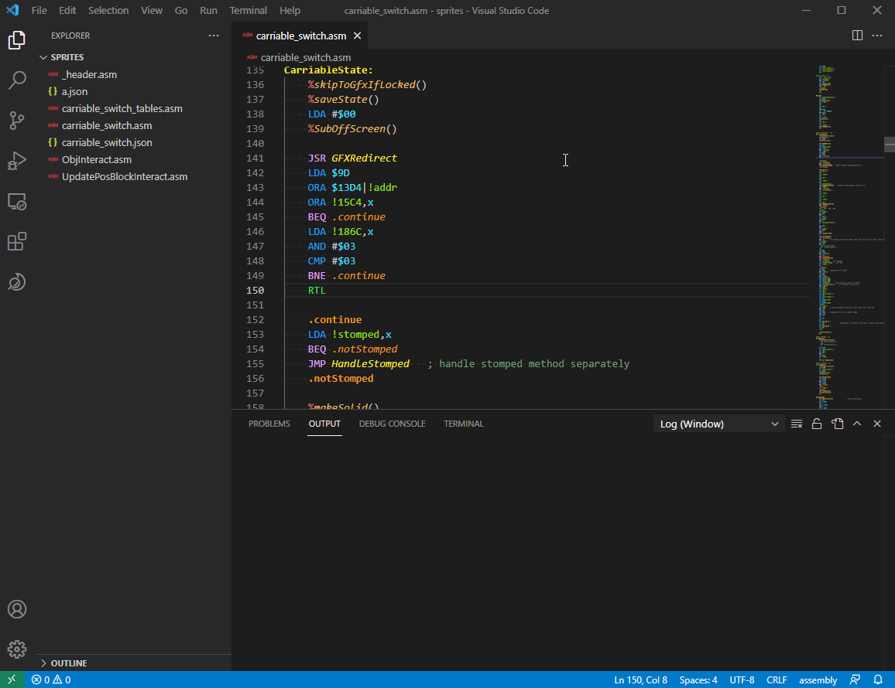

# SMWMapLens README
### Available on the marketplace
Link [here](https://marketplace.visualstudio.com/items?itemName=AtariSMWC.smwmaplens)
## Features

Gives "on hover" tooltips about RAM/ROM/Regs addresses of Super Mario World.
All the information is directly taken from the SMWC Maps.

## Requirements

Requirements (non-dev ones):
- [Axios](https://www.npmjs.com/package/axios)  
- [get-nonce](https://github.com/theKashey/get-nonce)  
- [marked](https://marked.js.org)  

## Known Issues

May not work perfectly with registers and some rom addresses.
False positives may occur. Please let me know with an issue if it happens.

## Extra credits
Searchbar icon made by AmperSam

## Release Notes

### 0.0.1

Initial release 

### 0.0.6 - 0.0.9

Search in sidebar has been added

### 0.1

Changed sidebar icon, fixed a couple of bugs

### 0.1.1

Ignore comment char in addition to whitespace [#1](https://github.com/Atari2/SMWMapLens/pull/1)

### 0.1.2

Make it so hijacks are also shown when hovering over ROM addresses.

### 0.1.3

Show "most specific" address instead of the first one found, this is usually the one with the smallest range. [#2](https://github.com/Atari2/SMWMapLens/pull/2)

Fix a bug where the on-hover would not show up if the address was at the start of the line.

# Demonstration

